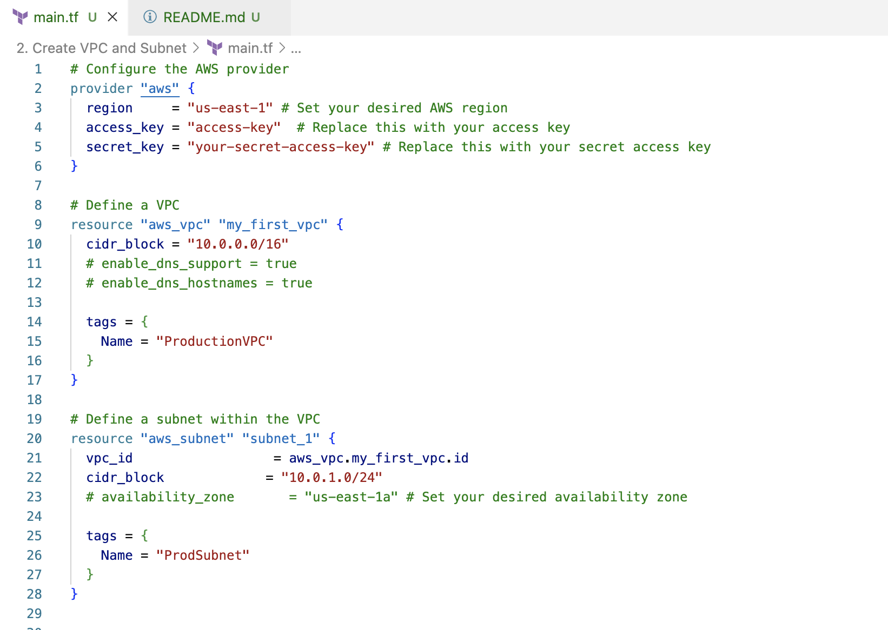
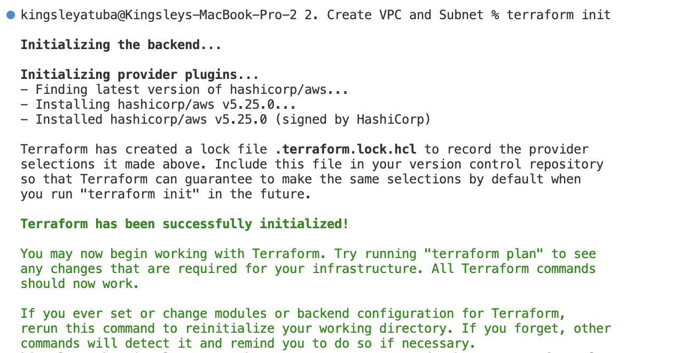
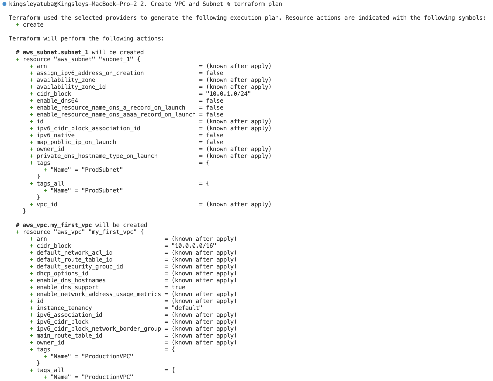
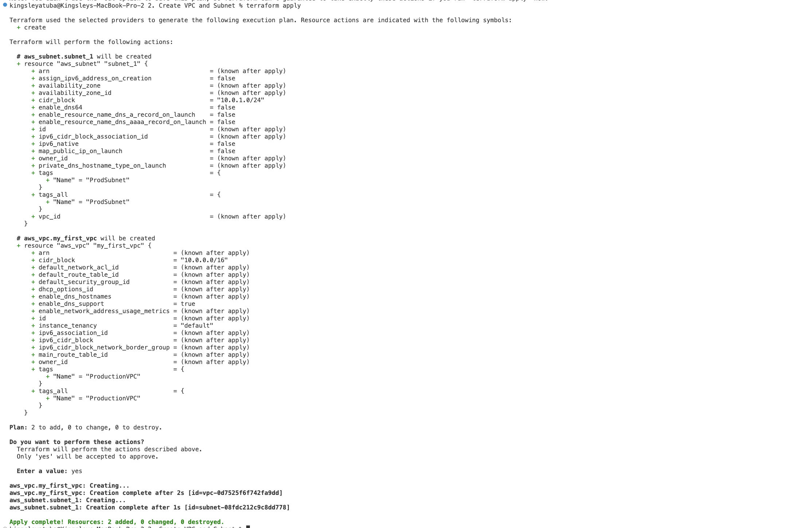
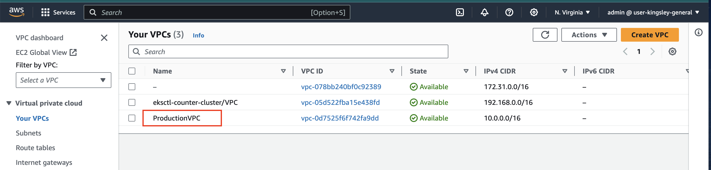
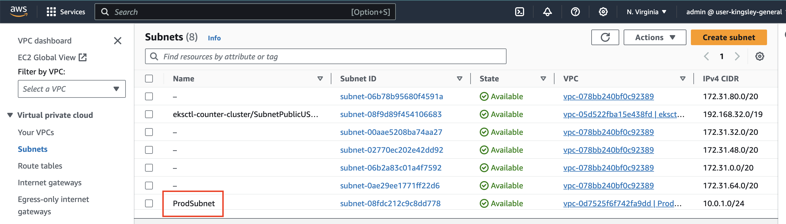
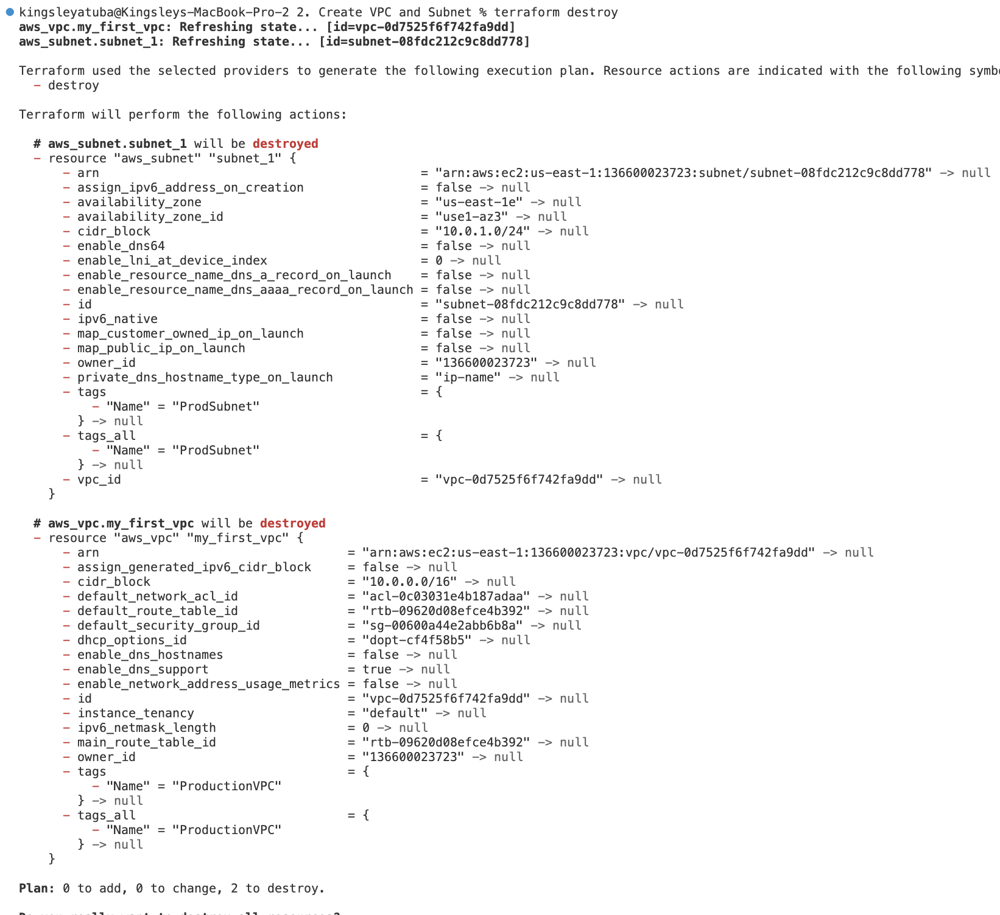

# Creating VPC and Subnets with Terraform


1. Configure the AWS provider to create the VPC and subnet in your main.tf file

```
provider "aws" {
  region     = "us-east-1" # Set your desired AWS region
  access_key = "access-key"  # Replace this with your access key
  secret_key = "your-secret-access-key" # Replace this with your secret access key
}

# Define a VPC
resource "aws_vpc" "my_first_vpc" {
  cidr_block = "10.0.0.0/16"
  # enable_dns_support = true
  # enable_dns_hostnames = true

  tags = {
    Name = "ProductionVPC"
  }
}

# Define a subnet within the VPC
resource "aws_subnet" "subnet_1" {
  vpc_id                  = aws_vpc.my_first_vpc.id
  cidr_block             = "10.0.1.0/24"
  # availability_zone       = "us-east-1a" # Set your desired availability zone

  tags = {
    Name = "ProdSubnet"
  }
}

# Define an EC2 instance within the subnet
# resource "aws_instance" "my_instance" {
#   ami           = "ami-0638741e0c9aabde6" 
#   instance_type = "t2.micro"
#   subnet_id     = aws_subnet.my_subnet.id
# 
#   tags = {
#     Name        = "MyTerraformInstance"
#     Environment = "Development"
#   }
# }

# Output the public IP address of the created instance
# output "instance_public_ip" {
#   value = aws_instance.my_instance.public_ip
# }
```



2. `terraform init`:  gets everything ready for your Terraform project. 
It sets up the tools and space needed to make changes to your cloud setup and keeps track of those changes.



3. `terraform plan`:  checks what changes you want to make to your cloud setup without actually making those changes. 
It tells you what will be added, modified, or removed in your infrastructure.



4. `terraform apply`: is like saying "make it happen" to Terraform. 
It takes your planned changes and actually applies them to your cloud infrastructure, creating or modifying resources as needed.




9. Check your aws to confirm that VPC and Subnet is created




10. Terminate resources using `terraform destroy`



# Congratulations!!!
